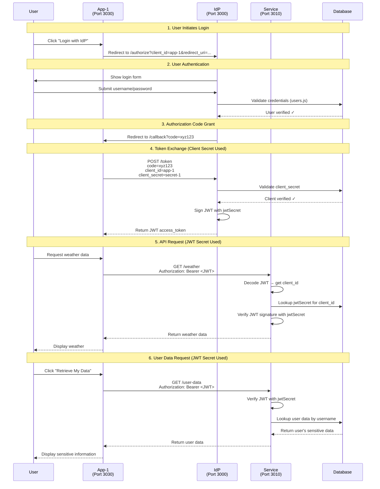

# OAuth 2.0 Authorization Workflow

This document explains the authorization and authentication flow in this security demonstration project.

## Architecture Overview

```
┌─────────────┐         ┌─────────────┐         ┌─────────────┐
│   App-1     │         │     IdP     │         │   Service   │
│  (Client)   │◄───────►│ (Auth Server)│         │   (API)     │
│             │         │             │         │             │
│ Port: 3030  │         │ Port: 3000  │         │ Port: 3010  │
└─────────────┘         └─────────────┘         └─────────────┘
      │                        │                        │
      │                        │                        │
      └────────────────────────┴────────────────────────┘
                               │
                    ┌──────────▼──────────┐
                    │  Database/          │
                    │  clients.json       │
                    │  user_data.json     │
                    └─────────────────────┘
```

## Two Secrets, Two Purposes

### Summary Table

| Secret Type | Stored In | Used Between | Purpose | Verification Point |
|-------------|-----------|--------------|---------|-------------------|
| **Client Secret** | [clients.json](file:///home/jbli/Develop/Security/Database/clients.json#L5) | App ↔ IdP | Authenticates the app to the IdP | [IdP/index.js:112](file:///home/jbli/Develop/Security/IdP/index.js#L112) |
| **JWT Secret** | [clients.json](file:///home/jbli/Develop/Security/Database/clients.json#L6) | IdP → Service | Signs and verifies JWT tokens | [Service/index.js:42](file:///home/jbli/Develop/Security/Service/index.js#L42) |

### Client Secret
- **Purpose**: App authentication with IdP
- **Verifies**: "Is this app legitimate and authorized to use this IdP?"
- **When**: During token exchange (authorization code → access token)
- **Who uses it**: App sends it, IdP validates it

### JWT Secret
- **Purpose**: JWT token signing and verification
- **Verifies**: "Was this token issued by the IdP and not tampered with?"
- **When**: Every API request to the Service
- **Who uses it**: IdP signs with it, Service verifies with it

## Complete Authorization Flow

### Step-by-Step Process



### Detailed Flow Description

#### Phase 1: User Login (Steps 1-3)
1. User clicks "Login with IdP" on App-1
2. App-1 redirects to IdP with `client_id` and `redirect_uri`
3. IdP shows login form
4. User enters credentials (e.g., `user1` / `password`)
5. IdP validates against `users.js`
6. IdP generates authorization code and redirects back to App-1

#### Phase 2: Token Exchange (Step 4) - **Client Secret Used**
1. App-1 receives authorization code
2. App-1 sends POST to IdP `/token` endpoint with:
   - Authorization code
   - `client_id`: "app-1"
   - **`client_secret`: "secret-1"** ← Proves app identity
   - `redirect_uri`
3. IdP validates the `client_secret` matches the one in `clients.json`
4. IdP signs JWT token with **`jwtSecret`** for that client
5. JWT contains: `{ sub: "1", username: "user1", aud: "app-1", ... }`
6. IdP returns JWT access token to App-1

#### Phase 3: API Requests (Steps 5-6) - **JWT Secret Used**
1. App-1 stores JWT in session
2. User requests weather or user data
3. App-1 sends request to Service with `Authorization: Bearer <JWT>`
4. Service extracts JWT from header
5. Service decodes JWT to get `aud` (client_id)
6. Service looks up **`jwtSecret`** for that client from `clients.json`
7. Service verifies JWT signature using **`jwtSecret`**
8. If valid, Service processes request and returns data

## Key Security Principles

### Separation of Concerns

```
┌──────────────────────────────────────────────────────┐
│ IdP's Responsibility                                 │
│ • Authenticate users                                 │
│ • Verify app legitimacy (using clientSecret)        │
│ • Issue JWT tokens (signed with jwtSecret)          │
└──────────────────────────────────────────────────────┘

┌──────────────────────────────────────────────────────┐
│ Service's Responsibility                             │
│ • Verify JWT tokens (using jwtSecret)               │
│ • Trust IdP's authentication decisions              │
│ • Provide protected resources                       │
└──────────────────────────────────────────────────────┘

┌──────────────────────────────────────────────────────┐
│ App's Responsibility                                 │
│ • Securely store clientSecret                       │
│ • Manage user sessions                              │
│ • Send JWT with API requests                        │
└──────────────────────────────────────────────────────┘
```

### Why Two Different Secrets?

**Defense in Depth**: Even if one secret is compromised, the system maintains security:

- **If `jwtSecret` is compromised**: Attacker can verify tokens but cannot get new tokens from IdP (needs `clientSecret`)
- **If `clientSecret` is compromised**: Attacker can get tokens but Service can still detect forged tokens (needs `jwtSecret` to forge)

### Per-Client JWT Secrets

Each client has its own `jwtSecret`:
- App-1: `jwt-secret-app-1-change-in-production`
- App-2: `jwt-secret-app-2-change-in-production`

This ensures **cryptographic isolation** between clients - a token issued for App-1 cannot be used by App-2.

## Configuration Files

### clients.json Structure
```json
{
  "clients": [
    {
      "clientId": "app-1",
      "clientSecret": "secret-1",           // ← For IdP authentication
      "jwtSecret": "jwt-secret-app-1...",   // ← For JWT signing/verification
      "redirectUris": ["http://localhost:3030/callback"]
    }
  ]
}
```

### user_data.json Structure
```json
[
  {
    "username": "user1",
    "secret": "This-is-a-secret-for-user-1",
    "Details": {
      "firstName": "User",
      "lastName": "1",
      "salary": 1000,
      "role": "user"
    }
  }
]
```

## Code References

| Component | File | Key Functions |
|-----------|------|---------------|
| **App-1** | [App-1/index.js](file:///home/jbli/Develop/Security/App-1/index.js) | Login flow, token exchange, API calls |
| **IdP** | [IdP/index.js](file:///home/jbli/Develop/Security/IdP/index.js) | Authorization, authentication, token issuance |
| **Service** | [Service/index.js](file:///home/jbli/Develop/Security/Service/index.js) | JWT verification, protected endpoints |
| **Config** | [Database/clients.json](file:///home/jbli/Develop/Security/Database/clients.json) | Client credentials and secrets |
| **User Data** | [Database/user_data.json](file:///home/jbli/Develop/Security/Database/user_data.json) | Per-user sensitive information |

## Testing the Flow

1. Start all services: `./start-all.sh`
2. Navigate to `http://localhost:3030`
3. Click "Login with IdP"
4. Enter credentials: `user1` / `password`
5. After login, test both features:
   - Get weather data (tests JWT verification)
   - Click "Retrieve My Data" (tests user-specific data retrieval)
